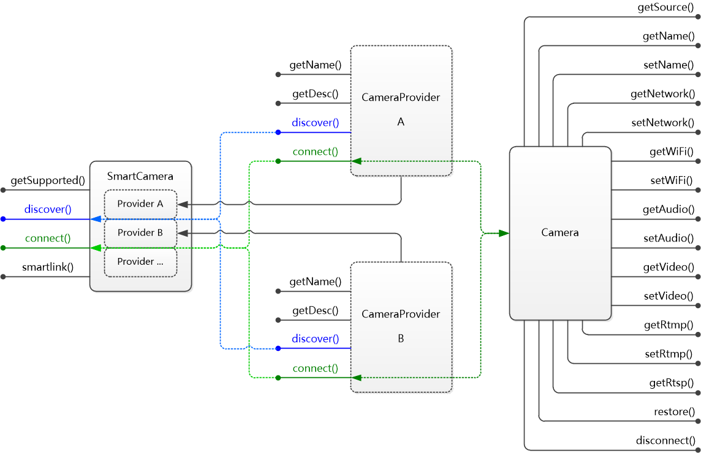

# SmartCamera_Android
适用于 Android 平台的智能摄像头 SDK，支持 SmartLink 智能配网、局域网发现，和摄像头的网络配置、音视频参数设置，以及 RTMP 推流设置等。
SmartCamera 旨在提供简单易用的 SDK，兼容包括互联网摄像头、监控摄像头等各种摄像头设备，实现对摄像头管理和配置的智能化和移动化。

## 认识 SmartCamera
- SDK 主体结构：

- SmartCamera，SmartCamera 是一个单例实例，是使用 SDK 的总入口
- CameraProvider，CameraProvider 是一个接口，针对不同厂商的摄像头，提供不同的 CameraProvider 实现
- Camera，Camera 同样是一个接口，针对不同厂商提供对应的实现

## 使用 SmartCamera
- 下载并导入 smartcamera-x.x.x.jar，同时导入 okHttp 相关的 jar 文件到工程。
- 范例代码：
```java
final SmartCamera g = SmartCamera.getInstance();

// SmartLink 智能配网
g.smartlink("APName", "APPassword", 10);

// 局域网发现
g.discover(g.getSupported(), new CameraDiscoveryConsumer(){

    @Override
    public void cameraDiscoverAbort(CameraProviderSource source) {
        System.out.println(String.format("ABORT: %s", source.getName()));
    }

    @Override
    public void cameraDiscoverTimeout(CameraProviderSource source) {
        System.out.println(String.format("TIMEOUT: %s", source.getName()));
    }

    @Override
    public void cameraDiscovered(CameraSource source) {
        System.out.println(String.format("FOUND: %s, %s", source.getName(), source.getUrl()));
        
        // 连接摄像头
        Camera camera = g.connect(source.getUrl());

        if(camera != null) {
            System.out.println(String.format("NAME: %s", camera.getName()));
            
            // 读取摄像头网络信息
            NetworkConfig netconf = camera.getNetwork();
        
            if(netconf != null)
                System.out.println(String.format("MAC: %s, DHCP: %s, IP: %s, MASK: %s, GATEWAY: %s, DNS1: %s, DNS2: %s",
                    netconf.macAddr, netconf.dhcp ? "yes" : "no", netconf.ip, netconf.mask, netconf.gateway, netconf.dns1, netconf.dns2));

            // 读取摄像头 WiFi 连接信息
            WiFiConfig wificonf = camera.getWiFi();

            if(wificonf != null)
                System.out.println(String.format("ENABLED: %s, SSID: %s, PWD: %s",
                    wificonf.enabled ? "yes" : "no", wificonf.ssid, wificonf.password));

            // 读取音频参数
            AudioConfig audioconf = camera.getAudio();
            
            if(audioconf != null)
                System.out.println(String.format("ENABLED: %s, CODEC: %d, SAMPLE: %d, BITRATE: %d, VOLUME: %d",
                    audioconf.enabled ? "yes" : "no", audioconf.codec, audioconf.samplerate, audioconf.bitrate, audioconf.volume));

            // 读取视频参数
            VideoConfig videoconf = camera.getVideo();
            
            if(videoconf != null)
                System.out.println(String.format("ENABLED: %s, CODEC: %d, RESO: %d, BRCTRL: %d, BITRATE: %d, FPS: %d",
                    videoconf.enabled ? "yes" : "no", videoconf.codec, videoconf.reso, videoconf.brctrl, videoconf.bitrate, videoconf.framerate));

            // 读取摄像头 RTMP 推流信息
            RtmpConfig rtmpconf = camera.getRtmp();
            
            if(rtmpconf != null)
                System.out.println(String.format("ENABLED: %s, RTMP: %s, USER: %s, PWD: %s",
                    rtmpconf.enabled() ? "yes" : "no", rtmpconf.rtmpUrl, rtmpconf.user, rtmpconf.password));
            
            // 读取摄像头 RTSP 播放地址
            RtspConfig rtspconf = camera.getRtsp();
            
            if(rtspconf != null)
                System.out.println(String.format("MAIN: %s, SUB: %s", rtspconf.mainUrl, rtspconf.subUrl));

            if("192.168.1.199".equals(source.getName())) {
                // 设置摄像头名称
                camera.setName("SmartCamera199");
                
                netconf = new NetworkConfig();
                
                netconf.dhcp = false;
                netconf.ip = "192.168.1.198";
                
                // 设置摄像头网络
                camera.setNetwork(netconf);
                
                wificonf = new WiFiConfig();

                // 设置摄像头 WiFi 连接信息
                camera.setWiFi(wificonf);
                
                audioconf = new AudioConfig();
                
                audioconf.enabled = false;
                audioconf.volume = 90;

                // 设置音频参数
                camera.setAudio(audioconf);

                videoconf = new VideoConfig();

                videoconf.reso = VideoConfig.RESO_1080P;
                videoconf.bitrate = 850;
                videoconf.brctrl = VideoConfig.CTRL_CBR;

                // 设置视频参数
                camera.setVideo(videoconf);

                // RTMP 推流参数
                rtmpconf = new RtmpConfig();

                // 设置 RTMP 推流
                camera.setRtmp(rtmpconf);
            }

            // 恢复出厂设置
            // camera.restore();

            // 断开连接
            camera.disconnect();
        }
    }
    
}, 5);
```


## 反馈及意见
当你遇到任何问题时，可以通过在 GitHub 的 repo 提交 issues 来反馈问题，请尽可能的描述清楚遇到的问题，如果有错误信息也一同附带，并且在 Labels 中指明类型为 bug 或者其他。
[通过这里查看已有的 issues 和提交 Bug](https://github.com/azhisoft/SmartCamera_Android/issues)
